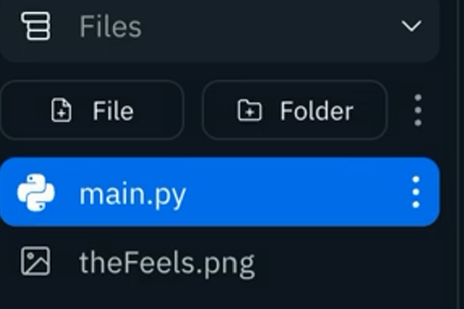

# tkinter Is Weird? Right?

**I will say it again for the people in the back. tkinter is horrible. I only showed you this so you will have more love and appreciation for what's coming up next. Click "mark lesson as complete" and skip ahead to Day 70 if tkinter is not your thing.**

Most GUI creators have a lovely drag & drop interface that makes life easy. tkinter doesn't, so it can feel awkward, fiddly, and frustrating at times.

However, it does give you full control of your GUI, and it's always good to learn the magic behind the scenes so you have a better understanding of what's going on.

Today, we're going to add images into our tkinter GUI.


👉 Let's start with the basic boilerplate GUI and define an image. To do this, I need to build a canvas and then create the image.

```python
import tkinter as tk

window = tk.Tk()
window.title("Hello World") 
window.geometry("300x200") 


hello = tk.Label(text = "Hello World") 
hello.pack() 

button = tk.Button(text = "Click me!") 
button.pack()

#### NEW BIT ######
canvas = tk.Canvas(window, width = 300, height=150) # Creates a placeholder for the image in the window.
canvas.pack()
image = tk.PhotoImage(file="theFeels.png") # Sets the file name of the image
canvas.create_image(150,1,image=image) #creates image and sets the co-ordinates for it (150 is horizontal center).
######

tk.mainloop()

```
Note that I've had to upload the image file to my repl.  You can just drag & drop it over to your files menu.



## Big Picture

You may have noticed that your image is HUGE.

👉 We can use `subsample` to resize it.  I've just included the relevant lines here.

```python
image = tk.PhotoImage(file="theFeels.png") 
image = image.subsample(5) # makes the image smaller by a factor of 5
canvas.create_image(150,1,image=image)
```

This technique is OK, but our canvas doesn't have an identifier, so we can't access it again if we need to.
##
👉 Here's the code that solves that problem.  I'm also going to make the button change the image on click.  All changes to the code are identified with comments.

```python
import tkinter as tk

window = tk.Tk()
window.title("Hello World") 
window.geometry("300x200") 

def changeImage(): # new Subroutine
  canvas.itemconfig(container, image = newImage) # itemconfig updates our canvas when this sub is called

hello = tk.Label(text = "Hello World") 
hello.pack() 

button = tk.Button(text = "Click me!", command=changeImage) # Given the button a command to call the changeImage subroutine.
button.pack()


canvas = tk.Canvas(window, width = 300, height=150) 
canvas.pack()
image = tk.PhotoImage(file="theFeels.png") 
image = image.subsample(5)

newImage = tk.PhotoImage(file="success.png") # filename of the replacement image assigned to newImage
newImage = newImage.subsample(5) # scaled down the new image

container = canvas.create_image(150,1,image=image) # Assigned create image to the container variable


tk.mainloop()
```

