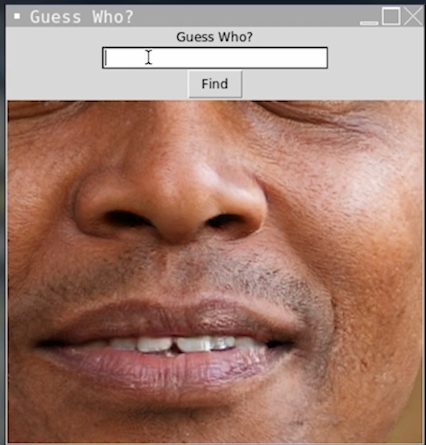

# 👉 Day 67 Challenge

I've provided you with a folder called "Guess Who" containing images of 4 people.

Your program should:

1. Prompt the user to input a name.
2. If the user inputs 'Charlotte', 'Gerald', 'Kate' or 'Mo', then their image should load.
3. Otherwise an 'image not found' message should display.

Example:

 
 💡 Hints 

  
- Pass the user input into the 'newImage' variable.
- Use `try... except` to load the image or generate the error.

